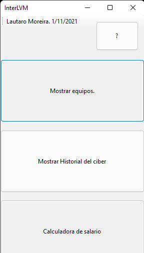
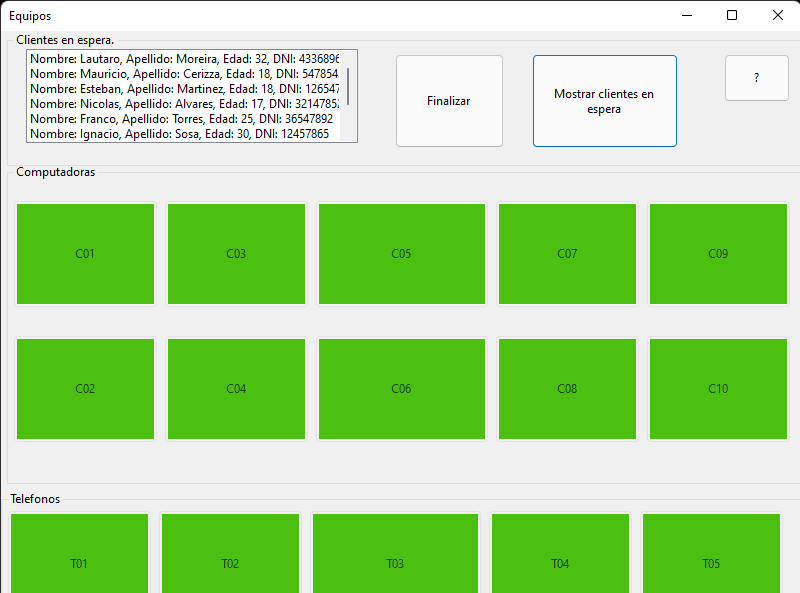
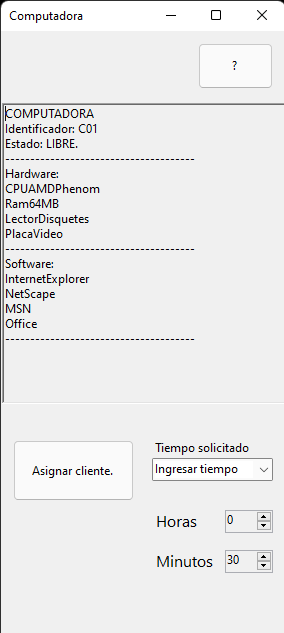
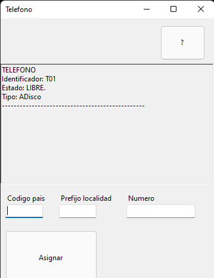
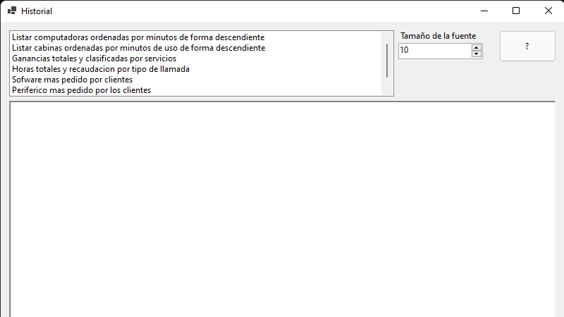
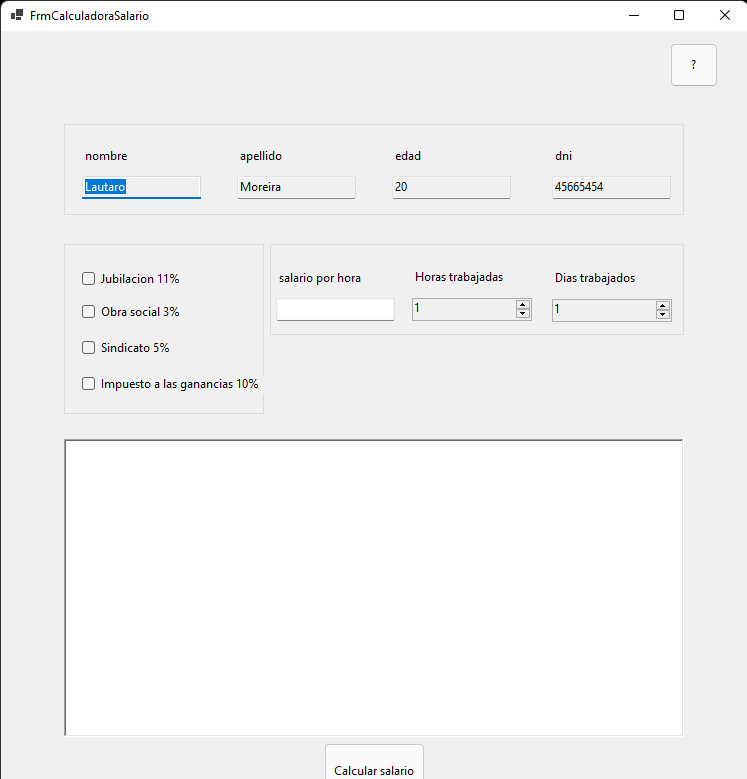
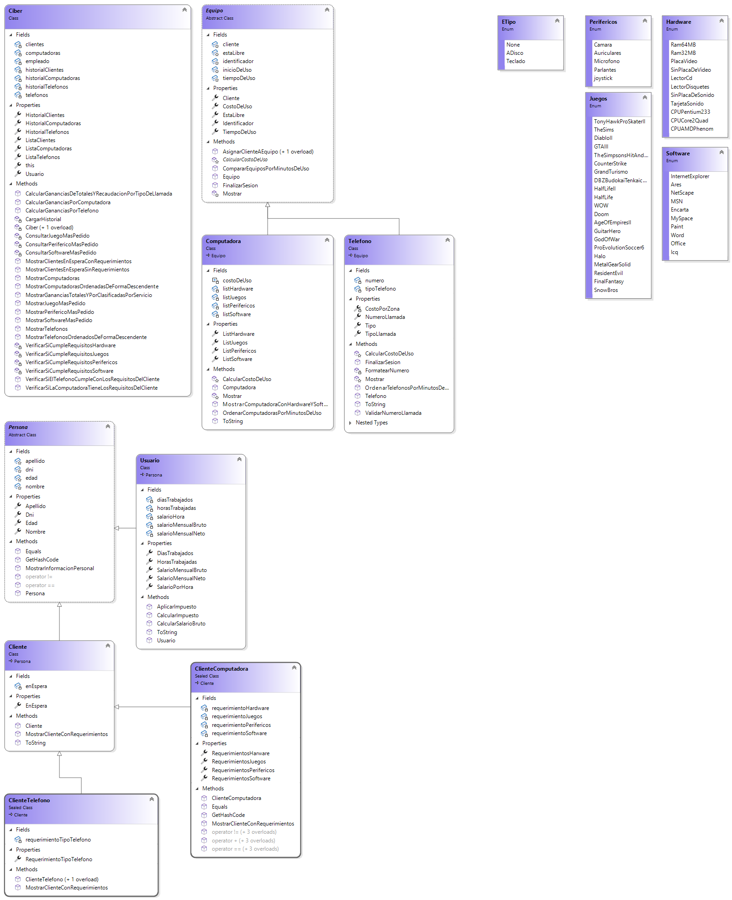
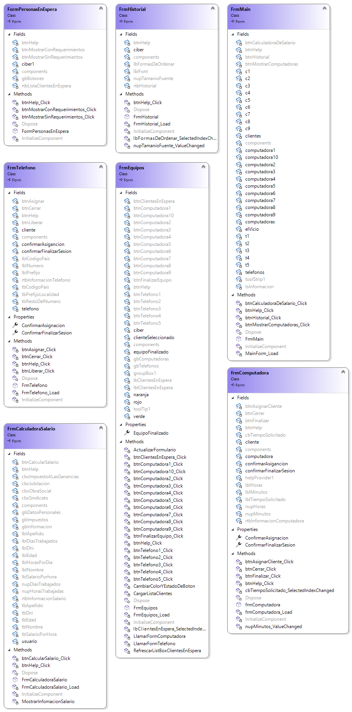

# InterLVM
*UTNFra Laboratorio de Computación II - Primer Parcial - Comisión 2do D - 2do cuatrimestre 2021*

[Enunciado del parcial](https://codeutnfra.github.io/programacion_2_laboratorio_2_apuntes/docs/evaluaciones/parciales/2d-primer-parcial/)

## Sobre mí

Soy Lautaro Moreira, tengo 20 años, vivo en Adrogue, partido de Almirante Brown.

Siento que esta fue una oportunidad muy grande para aplicar los conocimientos de la materia ya que mientras iba escribiendo el codigo aprendia de mis errores y investigaba como funcionaban las cosas. Lo mas complicado y a la vez divertido fue empezar a diagramar las clases y pensar como iban a ser los forms para la GUI.

## Resumen

Esta aplicacion comienza con un ventana de inicio que te da tres opciones.

- Boton maquinas:
    En este form encontraras una interfaz simple, donde se te mostraran todas las maquinas.
    Las que esten disponibles apareceran en color verde, en rojo las que estan ocupadas y en color naranja las que no cumplan los requisitos del cliente pero estan libres.
    Dentro de este form podras seleccionar un cliente apretando en la lista de clientes arriba a la izquierda.
    *Para listar los clientes con requisitos se debera apretar el boton mostrar clientes en espera.*
    Si queremos asignar un cliente y este tiene requisitos en especial solamente podra ser asignado al equipo que se encuentre disponible (en verde).
    

        
- Computadora:
    
En esta ventana encotraremos dos opciones para asignar a un cliente.

- Libre : *Prodremos asignar al cliente con un tiempo determinado.*
- Ingresar tiempo: *Aqui nos apareceran dos lugares para ingresar la hora y los minutos.*
y nos aparecer la informacion de la maquina con sus componentes y juegos en el cuadro de texto de arriba.

 - Telefono

    En esta ventana aprarecera el boton asignar, pero antes debemos ingresar el codigo pais, codigo de area y el resto del numero.
        
    luego de asignar el cliente al equipo aparecera en rojo la maquina donde se lo asigno.

    Para liberarla y finalizar la sesion se debera apretar el boton finalizar en la ventana equipos y se abilitaran las maquinas que estan en uso.

    cuando apretamos una maquina para finalizar aparecera la ventana de computadora o telefono respectivamente, y podremos finalizar la sesion del equipo.
    

-  Historial
   : Aqui encontraras un cuadro de texto donde se mostrar la informacion que selecciones en la lista de la izquierda.
   *Tambien podras modificar el tamaño de la letra en el cuado de texto.* 

    
   

- Calcular salario
    
    - Este formulario te permitira calcular el salario del usuario, ingresando el salario por hora, las horas trabajadas y los dias trabajados. Tambien te permitira calcular impuestos si los seleccionas.

## Diagrama de clases

###Entidades.

###Formularios

## Justificación técnica

### Clase 01
#### C# y .NET
El codigo fue escrito en el lenguaje c# con el framework .net

##Clase 02
### Clases y metodos estaticos
Utilizacion de metodo estatico para validar que el numero ingresado sea correcto. Ya que en el metodo estatico no es necesario tener un objeto para llamarlo y se puede utilizar desde cualquier lugar del codigo.

## Clase 03 
### Programacio orientada a objetos.
Todo el codigo fue en base a la programacion orientada a objetos.
Abstrayendome de los datos que me importan de los objetos generados utilizando constructores y sobrecargas de estos.

## clase 04
### Sobrecargas
Se utilizaron sobrecargas de metodos y constructores para utilizar dependiendo de las necesidades y de los datos que nos bridan.
Tambien se utilizaron las sobrecargas de los operadores +, == y != para cargar y asignar los requerimientos de los clientes para las computadoras.

## clase 05
### Windows forms.
La utilizacion de Windows forms para la parte de GUI.

## clase 06
### Colecciones
Se utilizaron colecciones en lists y queue para guardar datos o los usuarios en la fila.

## clase 07
### Encapsulamiento
La forma en la que se creo las clases tratando de proteger la informacion necesaria para que el codigo se mantenga seguro.
Tambien se uso indexador en el ciber para el array de telefonos.
Enumerados: se utilizaron para los requerimientos de los clientes y componentes que tienen las computadoras.

## clase 08
### Herencia y clases selladas.
Hay clases como la la clase Equipo que son abstractas y son base de las clases telefono o computadora.
Clases selladas como ClienteTelefono o clienteComputadora.

## Clase 09
### Polimorfismo
Se aplico polimorfismo en las clases Equipo, Telefono y computadora. Para la sobre escritura de algunos metodos que puedan utilizarse con el mismo fin pero teniendo distintos comportamientos dependiendo de que tipo sean.

## Propuesta de valor agregado

La propuesta de valor agregado fue la calculadora de salario.

Pudiendo calcular el salario del empleado ingresando cuanto se le paga por hora, cuantas horas trabaja por dia y cuantos dias al mes.

Tambien se podran agregar impuestos a este salario, que se le restaran al salario bruto convirtiendolo en salario neto.

Los impuestos son
- jubilacion
- Obra social
- aportes al sindicato
- impuestos a las ganancias (Solamente si el salario neto es mayor a 500)

